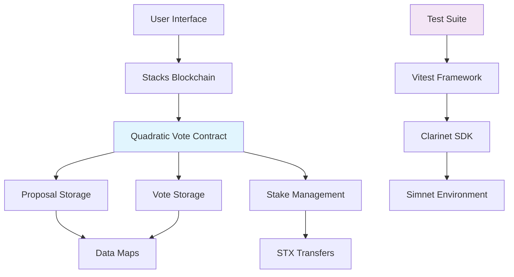
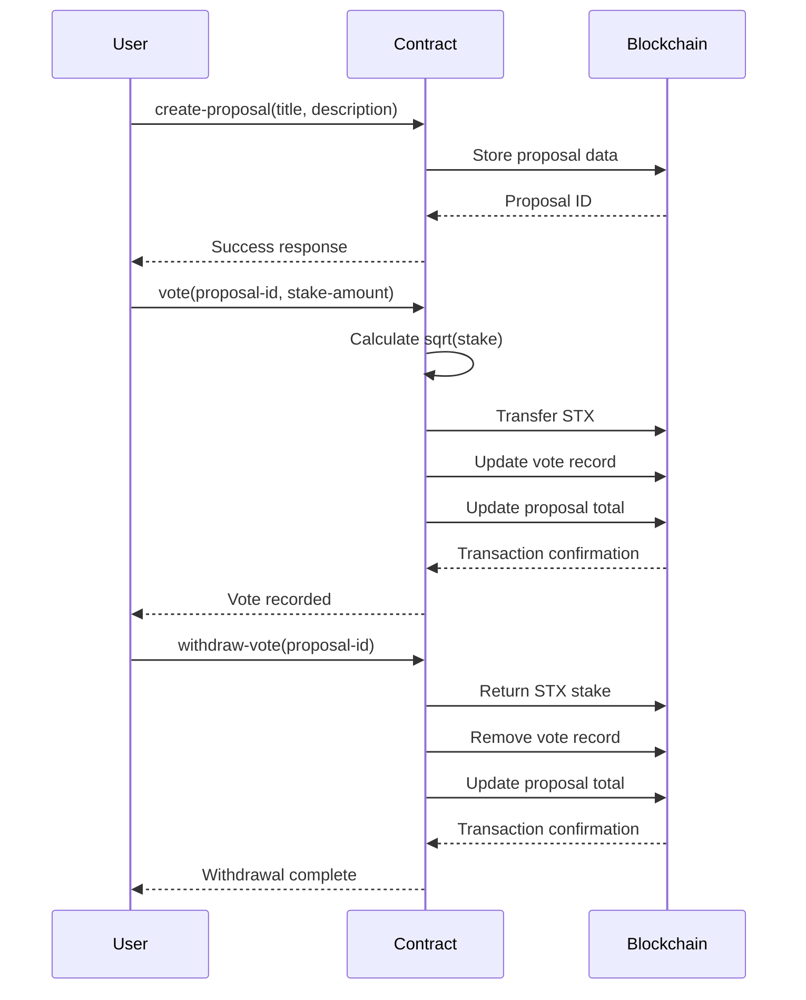

# Quadratic Voting DAO on Stacks Blockchain

[](https://github.com/hirosystems/clarinet)
[](https://clarity-lang.org/)
[](https://www.typescriptlang.org/)
[](https://vitest.dev/)
[](LICENSE)

> A comprehensive implementation of quadratic voting for decentralized autonomous organizations (DAOs) on the Stacks blockchain. This project demonstrates advanced smart contract development, quadratic voting mechanics, and thorough testing practices.

## Table of Contents

- [Overview](#overview)
- [Features](#features)
- [Architecture](#architecture)
- [System Design](#system-design)
- [Getting Started](#getting-started)
- [Prerequisites](#prerequisites)
- [Installation](#installation)
- [Usage](#usage)
- [Testing](#testing)
- [API Reference](#api-reference)
- [Contributing](#contributing)
- [License](#license)
- [Acknowledgments](#acknowledgments)

## Overview

This project implements a quadratic voting system for DAOs on the Stacks blockchain using Clarity smart contracts. Quadratic voting is a voting mechanism where the cost of votes increases quadratically with the number of votes cast, allowing participants to express the intensity of their preferences more accurately than traditional one-person-one-vote systems.

The contract enables:
- Proposal creation and management
- Stake-based quadratic voting
- Vote withdrawal functionality
- Comprehensive event logging

This implementation serves as both a functional DAO tool and an educational resource for learning blockchain development, smart contract security, and decentralized governance mechanisms.

## Features

### Core Functionality
- **Proposal Management**: Create and track governance proposals with rich metadata
- **Quadratic Voting**: Implement sqrt(stake) voting weight calculation for fair representation
- **Stake Management**: Secure STX token staking and withdrawal mechanisms
- **Event Logging**: Comprehensive transaction logging for transparency

### Technical Features
- **Clarity 4.0 Compatibility**: Built for the latest Clarity language features
- **Epoch 3.3 Support**: Compatible with Stacks blockchain's current epoch
- **Comprehensive Testing**: 100% test coverage with Vitest framework
- **Type Safety**: Full TypeScript integration for test suites
- **Security Audited**: Implements best practices for smart contract security

### Educational Value
- **Modular Architecture**: Clean separation of concerns for learning purposes
- **Extensive Documentation**: Detailed code comments and architectural explanations
- **Testing Best Practices**: Examples of comprehensive smart contract testing
- **Real-world Application**: Practical implementation of advanced voting theory

## Architecture

The system follows a modular architecture designed for clarity, security, and extensibility:



### Contract Components

- **Proposal Management**: Handles creation and storage of governance proposals
- **Voting Logic**: Implements quadratic voting calculations and vote tracking
- **Stake Handling**: Manages STX token transfers and stake calculations
- **Read Functions**: Provides query interfaces for proposal and vote data

## System Design

The quadratic voting system operates through a carefully designed workflow:



### Key Design Principles

1. **Quadratic Voting**: Vote weight = √(stake) ensures diminishing returns for large stakes
2. **Immutable Records**: All proposals and votes are permanently recorded on-chain
3. **Secure Transfers**: STX tokens are properly managed with transfer validations
4. **Event-Driven**: All state changes emit events for external monitoring
5. **Gas Efficient**: Optimized operations to minimize transaction costs

## Getting Started

Follow these steps to set up the development environment and start working with the quadratic voting contract.

## Prerequisites

Before you begin, ensure you have the following installed:

- **Node.js** (v18 or higher) - [Download](https://nodejs.org/)
- **Clarinet** (v2.0 or higher) - [Installation Guide](https://github.com/hirosystems/clarinet#installation)
- **Git** - [Download](https://git-scm.com/)
- **VS Code** (recommended) - [Download](https://code.visualstudio.com/)

### System Requirements
- **OS**: Windows 10+, macOS 10.15+, or Linux
- **RAM**: 4GB minimum, 8GB recommended
- **Storage**: 2GB free space for dependencies and blockchain data

## Installation

1. **Clone the repository**
   ```bash
   git clone <repository-url>
   cd quadratic-vote-contract
   ```

2. **Install dependencies**
   ```bash
   npm install
   ```

3. **Verify Clarinet installation**
   ```bash
   clarinet --version
   ```

4. **Check contract syntax**
   ```bash
   clarinet check
   ```

## Usage

### Development Workflow

1. **Start development environment**
   ```bash
   clarinet console
   ```

2. **Run tests**
   ```bash
   npm test
   ```

3. **Watch mode for continuous testing**
   ```bash
   npm run test:watch
   ```

### Contract Deployment

1. **Deploy to devnet**
   ```bash
   clarinet deployments generate --devnet
   clarinet deployments apply --devnet
   ```

2. **Deploy to testnet**
   ```bash
   clarinet deployments generate --testnet
   clarinet deployments apply --testnet
   ```

### Example Usage

```typescript
// Create a proposal
const proposalId = await callContract(
  simnet,
  accounts,
  "quadratic-vote",
  "create-proposal",
  [
    Cl.stringUtf8("Implement Quadratic Voting"),
    Cl.stringUtf8("Proposal to implement quadratic voting in our DAO")
  ],
  deployer.address
);

// Vote on proposal with 100 STX stake
await callContract(
  simnet,
  accounts,
  "quadratic-vote",
  "vote",
  [Cl.uint(proposalId), Cl.uint(100)],
  voter.address
);
```

## Testing

The project includes comprehensive test coverage using Vitest and Clarinet SDK.

### Running Tests

```bash
# Run all tests
npm test

# Run tests with coverage report
npm run test:report

# Run tests in watch mode
npm run test:watch
```

### Test Structure

- **Unit Tests**: Individual function testing
- **Integration Tests**: Multi-function workflow testing
- **Edge Case Tests**: Error condition and boundary testing
- **Security Tests**: Authorization and validation testing

### Test Coverage

Current test coverage includes:
- Proposal creation and validation
- Voting mechanics and calculations
- Stake management and transfers
- Error handling and edge cases
- Read-only function queries

## API Reference

### Public Functions

#### `create-proposal`
Creates a new governance proposal.

**Parameters:**
- `title` (string-utf8 128): Proposal title
- `description` (string-utf8 512): Proposal description

**Returns:** `(response uint)` - New proposal ID

#### `vote`
Casts a quadratic vote on a proposal.

**Parameters:**
- `proposal-id` (uint): Target proposal ID
- `stake-amount` (uint): STX amount to stake

**Returns:** `(response bool)` - Success confirmation

#### `withdraw-vote`
Withdraws stake and removes vote from proposal.

**Parameters:**
- `proposal-id` (uint): Target proposal ID

**Returns:** `(response bool)` - Success confirmation

### Read-Only Functions

#### `get-proposal`
Retrieves proposal details.

**Parameters:**
- `id` (uint): Proposal ID

**Returns:** `Optional proposal data`

#### `get-proposal-count`
Gets total number of proposals.

**Returns:** `uint` - Proposal count

#### `get-vote`
Retrieves vote details for a voter.

**Parameters:**
- `proposal-id` (uint): Proposal ID
- `voter` (principal): Voter address

**Returns:** `Optional vote data`

## Contributing

We welcome contributions from the community! This project is designed as an educational resource, so contributions that enhance learning value are particularly appreciated.

### Development Process

1. **Fork the repository**
2. **Create a feature branch**
   ```bash
   git checkout -b feature/your-feature-name
   ```
3. **Make your changes**
4. **Add tests for new functionality**
5. **Ensure all tests pass**
   ```bash
   npm test
   ```
6. **Submit a pull request**

### Contribution Guidelines

- **Code Style**: Follow existing code patterns and Clarity best practices
- **Testing**: Add comprehensive tests for all new features
- **Documentation**: Update README and code comments as needed
- **Security**: Consider security implications of all changes

### Areas for Contribution

- **Additional Features**: New voting mechanisms or proposal types
- **Documentation**: Tutorials, guides, or educational content
- **Testing**: More comprehensive test cases or fuzzing
- **Performance**: Gas optimization and efficiency improvements
- **Security**: Additional security checks and audits

## License

This project is licensed under the ISC License - see the [LICENSE](LICENSE) file for details.

## Acknowledgments

- **Stacks Foundation** for the Clarity programming language
- **Hiro Systems** for the Clarinet development framework
- **Quadratic Voting Research** community for the theoretical foundation
- **Open Source Community** for testing frameworks and tools

---

**Built with ❤️ for the Stacks ecosystem**

*Learn • Build • Govern*</content>
<parameter name="filePath">g:\2025\Learning\Blockchain\Stacks\Counter\quadraticVote\contract\README.md